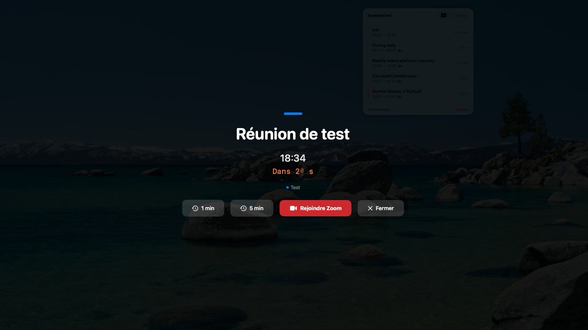
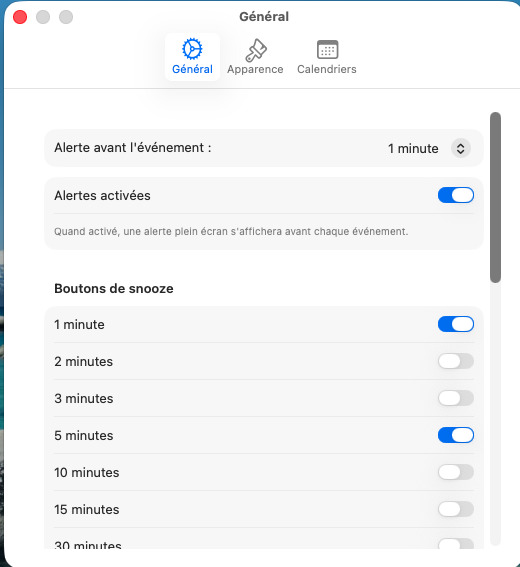
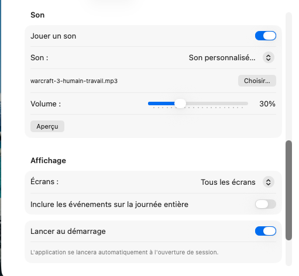
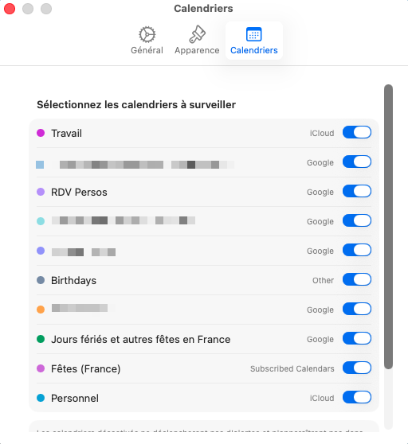

# ScreenAlert

Application macOS qui se loge dans la barre de menu et affiche des alertes plein ecran avant le debut de vos evenements calendrier. Impossible de manquer une reunion, meme en mode plein ecran.

<!-- screenshot: Vue d'ensemble de l'alerte plein ecran -->


---

## Table des matieres

- [Fonctionnalites](#fonctionnalites)
- [Parametres](#parametres)
- [Installation](#installation)
- [Compilation](#compilation)
- [Configuration requise](#configuration-requise)
- [Structure du projet](#structure-du-projet)

---

## Fonctionnalites

- **Alertes plein ecran** : superposition visible par-dessus toutes les fenetres (y compris plein ecran) avec compte a rebours colore (blanc > orange > rouge).
- **Integration visioconference** : bouton "Rejoindre" automatique pour Zoom, Google Meet, Teams, Webex et Slack.
- **Snooze et fermeture** : report d'alerte (duree configurable) ou fermeture definitive pour l'evenement.
- **Surveillance calendrier** : synchronisation automatique avec Apple Calendar (supporte tous les comptes locaux/iCloud/Exchange).
- **Interface barre de menu** : liste des prochains evenements, statut (actif/pause), et acces rapide aux reglages.
- **Multi-ecran** : affichage de l'alerte sur tous les moniteurs connectes ou seulement l'ecran principal.
- **Demarrage automatique** : lancement optionnel a l'ouverture de session.
- **Son d'alerte** : bip systeme, sons macOS, ou fichier audio personnalise.

---

## Parametres

### Onglet General

| Parametre | Description | Valeurs par defaut |
|---|---|---|
| Delai d'alerte | Minutes avant l'evenement pour declencher l'alerte | 1 min |
| Durees de snooze | Choix multiples pour le bouton snooze | 1, 5, 15 min |
| Son d'alerte | Activer/desactiver et choix du son (systeme ou perso) | Oui (Bip) |
| Demarrage auto | Lancer l'app a l'ouverture de session | Oui |

<!-- screenshot: Onglet General des preferences -->



### Onglet Apparence

| Parametre | Description | Valeurs par defaut |
|---|---|---|
| Ecrans | Afficher sur tous les ecrans ou principal uniquement | Tous |
| Opacite | Transparence du fond de l'alerte (30-100%) | 88% |
| Couleurs | Personnalisation du fond et du bouton "Rejoindre" | Noir / Vert |

<!-- screenshot: Onglet Apparence des preferences -->


### Onglet Calendriers

Selectionnez individuellement les calendriers a surveiller.

<!-- screenshot: Onglet Calendriers des preferences -->


---

## Installation

1. Telecharger `ScreenAlert.zip` depuis la [derniere release](https://github.com/briangtn/ScreenAlerts/releases/latest)
2. Dezipper et copier `ScreenAlert.app` dans `/Applications`
3. Lancer l'app et autoriser l'acces au calendrier

## Compilation

```bash
./build.sh          # Debug
./build.sh release  # Release
```

## Configuration requise

- macOS 14.0+ (Sonoma)
- Apple Silicon (arm64)
- Permission d'acces au calendrier

## Structure du projet

```
Sources/
├── ScreenAlertApp.swift              # Point d'entree
├── Managers/FullScreenWindowManager.swift # Gestion fenetres overlay
├── Services/                         # Logique metier (Calendar, Scheduler)
└── Views/                            # UI SwiftUI (Alert, MenuBar, Settings)
```

## Licence

All rights reserved.
