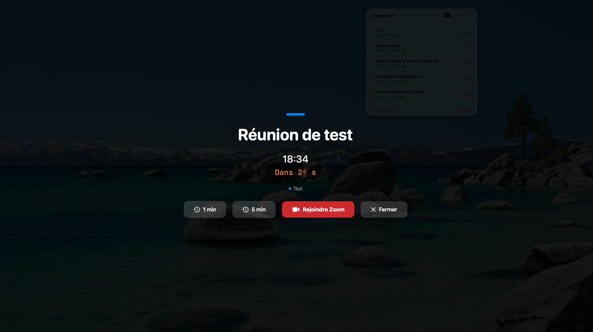
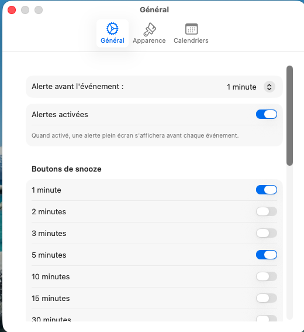
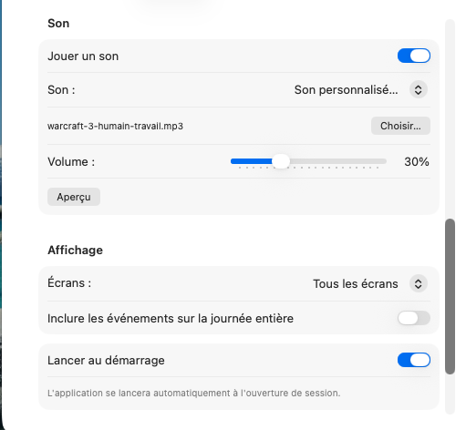
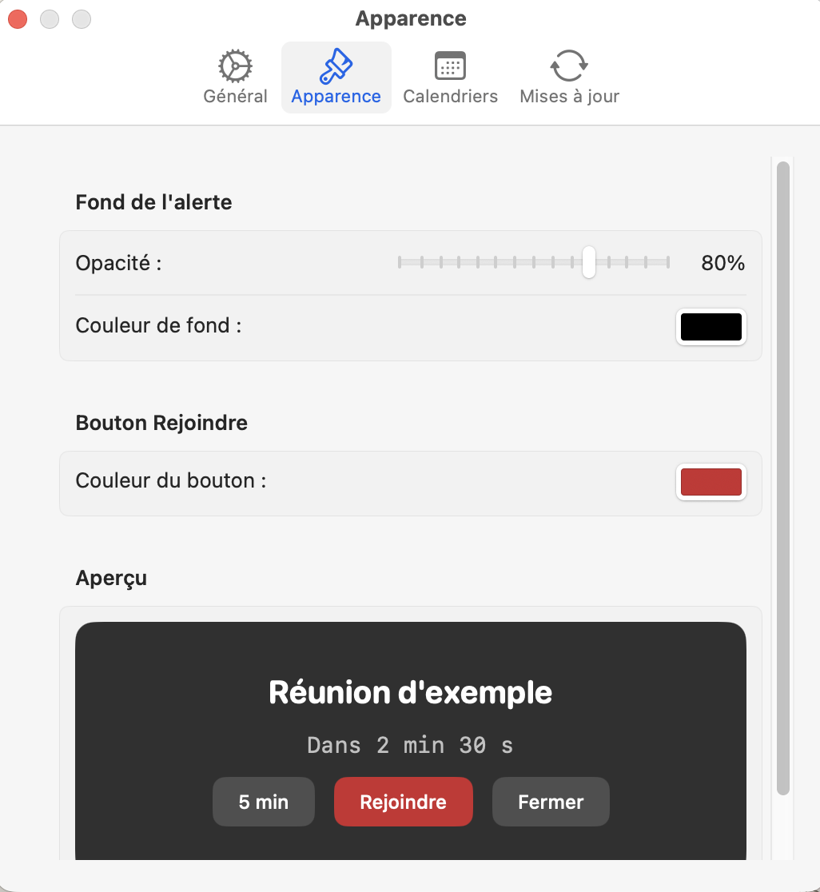
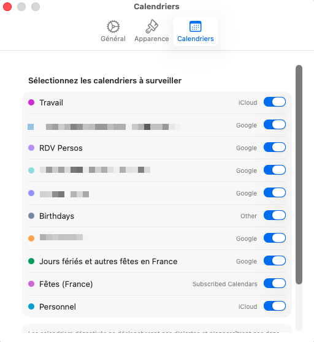

# ScreenAlert

**Never miss a meeting again.** A macOS menu bar app that displays full-screen overlay alerts before your calendar events start — even over full-screen apps.

> [!WARNING]
> This project is entirely **vibe-coded** — 100% of the code was written by AI. Use at your own risk, contributions welcome!

> [!NOTE]
> **Fully local & private.** ScreenAlert runs entirely on your Mac — no account, no server, no data leaves your machine. It reads your calendars through Apple's EventKit framework and stores preferences locally via UserDefaults.



---

## Features

- **Full-screen overlay alerts** — Covers all windows (including full-screen apps) with a live countdown that changes color as time runs out (white → orange → red)
- **Video conferencing integration** — Automatically detects meeting links and shows a "Join" button for Zoom, Google Meet, Microsoft Teams, Webex, and Slack Huddles
- **Snooze & dismiss** — Configurable snooze durations or permanent dismiss per event
- **Calendar sync** — Reads from Apple Calendar (EventKit), supports all account types (iCloud, Google, Exchange, etc.)
- **Menu bar interface** — Shows upcoming events, pause/resume toggle, test alert, and quick access to preferences
- **Multi-monitor support** — Alerts on all connected screens or primary only
- **Custom alert sounds** — System beep, macOS built-in sounds, or your own audio file with volume control
- **Launch at login** — Auto-start via macOS ServiceManagement
- **Auto-update** — Built-in updates via the Sparkle framework
- **Keyboard shortcuts** — `Enter` to join the meeting, `Escape` to dismiss

---

## Installation

### Homebrew (recommended)

```bash
brew tap briangtn/tap
brew install --cask screenalert
```

To update:

```bash
brew upgrade --cask screenalert
```

### Manual

1. Download `ScreenAlert.zip` from the [latest release](https://github.com/briangtn/ScreenAlert/releases/latest)
2. Unzip and move `ScreenAlert.app` to `/Applications`
3. Launch the app and grant calendar access when prompted

---

## Building from Source

Requires Xcode command line tools and Swift 6.1+.

```bash
git clone https://github.com/briangtn/ScreenAlert.git
cd ScreenAlert

./build.sh          # Debug build
./build.sh release  # Release build (optimized)
./build.sh run      # Build and run
```

The build script creates a proper `.app` bundle, embeds the Sparkle framework, and installs to `/Applications`.

---

## Usage

Once launched, ScreenAlert lives in your menu bar. It monitors your Apple Calendar and triggers an overlay alert before each event based on your configured lead time.

The alert overlay appears above everything — including full-screen apps and multiple desktops — so you never miss a meeting even when deep in focus mode.

If the event contains a video conferencing link (in the URL, location, or notes field), a colored "Join" button appears to open it directly.

---

## Settings

Open preferences from the menu bar dropdown → **Preferences...** (or `⌘,`).

### General

Configure when and how alerts are triggered.

| Setting | Description | Default |
|---|---|---|
| Alert timing | Minutes before the event to trigger the alert (0–15 min) | 1 min |
| Alerts enabled | Toggle all alerts on/off | On |
| Snooze durations | Which snooze buttons to display (1, 2, 3, 5, 10, 15, 30, 60 min) | 1, 5 min |
| Alert sound | System beep, macOS sound, or custom audio file | Beep |
| Volume | Sound volume (0–100%) | 100% |
| Screens | Show alert on all screens or primary only | All screens |
| All-day events | Include all-day events in the event list | Off |
| Launch at login | Start ScreenAlert at login | On |

<details>
<summary>Screenshots</summary>





</details>

### Appearance

Customize the look of the alert overlay.

| Setting | Description | Default |
|---|---|---|
| Overlay opacity | Background transparency (30–100%) | 88% |
| Overlay color | Background color of the alert | Black |
| Accent color | Color of the "Join" button | Green |
| Text color | Color of the alert text | White |

A live preview updates as you tweak the settings.

<details>
<summary>Screenshot</summary>



</details>

### Calendars

Choose which calendars to monitor. All calendars from Apple Calendar are listed — toggle individually.

<details>
<summary>Screenshot</summary>



</details>

---

## How It Works

1. **CalendarService** requests EventKit access and fetches events for the next 24 hours, refreshing every 5 minutes and on any calendar change
2. **AlertScheduler** runs a 1-second timer, checking if any event is within the configured alert window
3. **FullScreenWindowManager** creates `NSPanel` windows at screen-saver level (`CGShieldingWindowLevel`) — above everything, on all Spaces
4. Canceled events and declined invitations are automatically excluded
5. On system wake from sleep, all tracking resets so morning alerts fire correctly

---

## Requirements

- **macOS 14.0+** (Sonoma)
- **Apple Silicon** (arm64)
- Calendar access permission

---

## License

All rights reserved.
